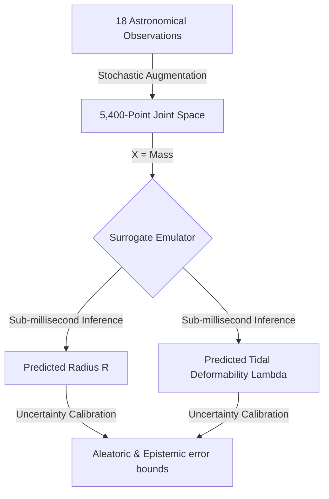

# Astro-Ligo (ns_infer)

### *An Empirical Machine Learning Emulator for Multi-Messenger Neutron Star Parameter Estimation*

[](LICENSE)
[](pyproject.toml)
[](src/ns_infer/physics/tov_solver.py)

`ns_infer` (hosted under the repository `Astro-Ligo`) is a research-grade Python package that functions as an **Empirical Astronomical Parameter Emulator and Lookup Tool**. Bypassing computationally expensive first-principles nuclear Equation of State (EOS) forward solvers during training, the pipeline regresses directly against stochastically augmented multi-messenger astronomical observations to map **Stellar Mass ($M$)** directly to **Stellar Radius ($R$)** and **Tidal Deformability ($\Lambda$)** with sub-millisecond execution speeds.

---

## 🌌 Scientific Framework & Reframing

### The Empirical Observer Paradigm
This pipeline does **not** solve the inverse nuclear physics problem of constraining the core Equation of State $P(\rho)$ from scratch. Instead, it is designed as an **empirical interpolator of the cosmic Mass-Radius ($M-R$) and Mass-Tidal Deformability ($M-\Lambda$) curves of our specific local Universe**. 

By training a **heteroscedastic Gaussian Deep Ensemble + MC Dropout** model directly on stochastically augmented joint observation posteriors (compiled from 18 high-vetted radio, X-ray, and gravitational wave systems), the surrogate emulates the underlying universal parameters while smoothing out individual telescope and detector noise.



### Addressing Systematic Uncertainties (Yagi–Yunes Compactness-Love Relation)
For X-ray burst and pulse profile stars where tidal deformability ($\Lambda$) is not directly measurable, we invert the **Yagi-Yunes Love-Compactness quasi-universal relation**:
$$C = 0.371 - 0.0391 \ln(\Lambda) + 0.001056 [\ln(\Lambda)]^2$$
to obtain the baseline $\Lambda$ mapping. 

> [!WARNING]
> **Systematic Uncertainty Propagation**:
> The Yagi-Yunes relation has a small but finite systematic scatter ($\sim 5-15\%$) depending on the true core EOS. In our emulator, we stochastically propagate this systemic variation as an **arbitrary fractional scatter** during the dataset generation phase. Our **Bayesian Neural Network Ensemble** naturally integrates this as part of its predicted **aleatoric (intrinsic data) uncertainty**, which is displayed in our final 95% confidence intervals.

---

## 🛠️ Setup & Installation

To run the pipeline locally, clone the repository, create a virtual environment, and install the package in editable mode:

```bash
# Clone the repository
git clone https://github.com/reetanshuh1998/Astro-Ligo.git
cd Astro-Ligo

# Create local virtual environment
python3 -m venv .venv
source .venv/bin/activate

# Install dependencies and package in editable mode
pip install -r requirements.txt
pip install -e .
```

*Note: For CPU-only execution (highly recommended for benchmark performance), install PyTorch via:*
```bash
pip install torch --index-url https://download.pytorch.org/whl/cpu
```

---

## 🚀 Execution & Reproducing Figures

The entire end-to-end scientific pipeline (data generation, training, joint evaluation, and figure generation) can be executed using the main orchestrator CLI:

```bash
# Run with 120 epochs for complete model loss convergence
python3 src/ns_infer/run_pipeline.py --mode mock --epochs 120
```

### How to Reproduce Figures 1–6
Upon successful execution, the script automatically compiles a dedicated suite of six premium publication-grade reporting plots under `outputs/figures/`:

1. **`01_mass_radius_comparison.png` (Figure 1: Reconstructed Mass-Radius Curve)**:
   - **Method**: Evaluates our XGBoost, Deterministic DNN, and BNN Ensemble models on the test split, plotting continuous curves overlaid with the 18 raw astronomical observations.
   - **Visual Overlays**: Overlays official collaboration error bars at $M=1.40 M_\odot$ (LIGO GW170817 $90\%$ CI green star, NICER J0030 $68\%$ CI blue pentagon) and $M=2.08 M_\odot$ (NICER J0740 $68\%$ CI purple hexagon).

2. **`02_mass_lambda_comparison.png` (Figure 2: Mass vs. Tidal Deformability)**:
   - **Method**: Emulates tidal deformability $\Lambda(M)$ across the mass spectrum (log-scale).
   - **Visual Overlays**: Overlays the official asymmetric LIGO GW170817 90% vertical credible interval at $M=1.40 M_\odot$ ($\Lambda_{1.4} = 300_{-190}^{+420}$).

3. **`03_uncertainty_calibration.png` (Figure 3: Calibration Diagnostic - 3-Panel)**:
   - **Method**: Computes Probability Integral Transform (PIT) value histograms, plots global expected vs. actual empirical coverage, and analyzes mass-dependent CI calibration across three distinct stellar mass bins.

4. **`04_observational_posteriors.png` (Figure 4: Mass-Radius Contours)**:
   - **Method**: Runs a 2D Gaussian Kernel Density Estimator (KDE) over the pre-computed observational posteriors for J0030+0451 and J0740+6620.

5. **`05_speed_accuracy_benchmark.png` (Figure 5: Performance Benchmarks)**:
   - **Method**: Compares the mean absolute error (MAE) across our ML models and benchmarks the single-star inference runtime directly against traditional MCMC codes.

6. **`06_uncertainty_breakdown.png` (Figure 6: Uncertainty Breakdown)**:
   - **Method**: Decouples BNN predictive standard deviations into total predictive, aleatoric (observational noise), and epistemic (model parameter/functional spacing) components as a function of stellar mass.

---

## 📜 Citation

If you use `ns_infer` or the `Astro-Ligo` repository in your research, please cite it as follows:

```bibtex
@software{ns_infer_astro_ligo,
  author       = {Reetanshu and Priyanshi},
  title        = {Astro-Ligo (ns_infer): An Empirical Machine Learning Emulator for Multi-Messenger Neutron Star Parameter Estimation},
  year         = {2026},
  publisher    = {GitHub},
  journal      = {GitHub Repository},
  howpublished = {\url{https://github.com/reetanshuh1998/Astro-Ligo}}
}
```

---

## 📝 MIT License
This project is licensed under the MIT License - see the [LICENSE](LICENSE) file for details.
